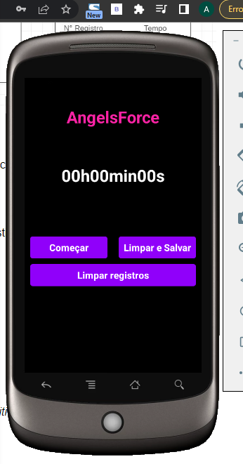
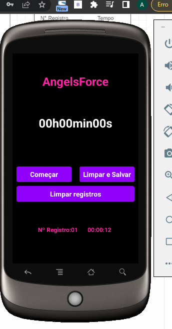

# Cronometer App

* The "Cronometer App" project involves the development of a mobile application using React Native, with the aim of creating a functional stopwatch.
* The app includes real-time clock display, the ability to start, pause, and reset the stopwatch, as well as a history feature that records marked times.
* Additionally, the app offers the option to reset the history, allowing the user to maintain a clean and organized record of timed activities.

* The "Cronometer App" is a versatile tool that can be used to track the time of various activities, from physical exercises to daily tasks.
* The user-friendly interface and comprehensive features make it a convenient choice for anyone in need of a reliable stopwatch app.

## Table of contents

- [Overview](#overview)
  - [Built with](#built-with)
  - [Screenshot](#Screenshot)
- [Author](#author)

## Overview
* Functional Stopwatch: The app was successfully developed, offering a functional stopwatch that can be started, paused, and reset as needed.

* Real-Time Display: The app displays elapsed time in real-time, allowing the user to accurately track the duration.

* Time History: The history feature was implemented, where marked times are recorded and can be easily reviewed.

* Option to Reset History: The app provides an option to reset the history, allowing the user to maintain an organized record of timed activities.

* User-Friendly Interface: The app's interface was designed with usability in mind, ensuring users can interact with ease.

* Versatile Use: The "Cronometer App" can be used to track time in a variety of activities, making it a versatile and useful tool.

### Built with

- HTML5
- REACT NATIVE
- CSS3
- JS and JSX

## Author

- Github - [#MyProfile](https://github.com/AlanDavid-007/Cronometer/)

### Screenshot

